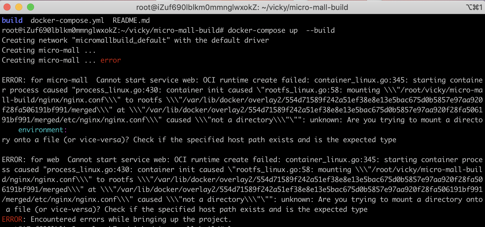

目录 

[TOC]

### 描述 👩‍💻👩‍💻👩‍💻

[访问地址](http://47.101.189.16:9001/)  

[GitHub仓库地址](https://github.com/Vickysir/micro-mall-build)

- 响应式设计，兼容web端主流浏览器与移动端设备，

-  docker部署

  

<div align=center style="margin-bottom:40px">
    
    
</div>
<div align=center style="margin-bottom:40px">
    
    
</div>
<div align=center style="margin-bottom:40px">
    
</div>

### 技术栈 :v: :v::v:

React + antd mobile + Node + Express + MongoDB

- react @16.8.6
- react-router-dom @5.0.1
- antd-mobile @2.2.14
- node @11.6.0
- express @4.16.0
- MongoDB @3.4.0
- docker @18.09.7
- docker-compose @1.17.1


### 主要功能 :point_down::point_down::point_down:
1. 登录、注册

2. 首页、商品详情

3. 购物车

4. 订单

6. 个人中心

   

------


### 收获🤔🤔🤔

- 部署。部署静态网页时，遇到些问题。只是编写了docker-compose.yml，并未在项目配置nginx.conf，导致挂载失败，对docker理解不透彻。

<div align=center style="margin-bottom:40px">
    
</div>

docker-compose.yml 文件

```javascript
version: '3'    ### docker-compose 的版本
services:
  web:         ### 在 services 标签下的第二级标签是 web，这个名字是用户自己自定义，它就是服务名称。
    container_name: product_main_source             ### 容器的名字
    image: "nginx:latest"            ### image 则是指定服务的镜像名称或镜像 ID ,一般web都用这个镜像
    restart: always                  ### 当值为 always 时，容器总是重新启动
    ports:
      - 8008:80       ### 映射端口，使用HOST:CONTAINER格式或者只是指定容器的端口，宿主机会随机映射端口
    volumes:    ### 挂载目录,使用 [HOST:CONTAINER:ro],数据卷是只读的，这样可以有效保护宿主机的文件系统
      - ./build:/usr/share/nginx/html:ro
      - ./nginx/nginx.conf:/etc/nginx/nginx.conf:ro
      
```

- 推荐一个[emoji](http://emojihomepage.com/)网站，click就会复制emoji表情，直接粘贴到Markdown文档中即可使用😎😎😎


### 还未实现的功能 🖤🙉😱💔

- 登录、注册

- node搭建后台、数据库，提供API

- 购物车、订单

  


### 欢迎交流 🙋🙋🙋

QQ：460022058
